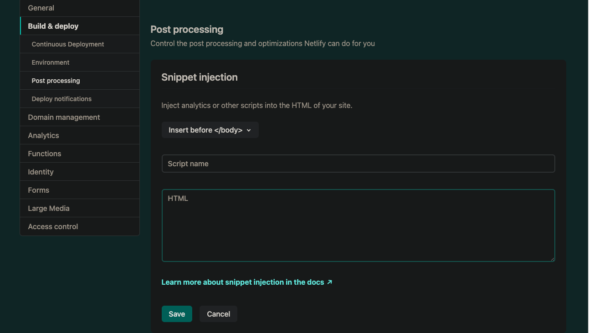

本ブログはGatsby+Netlifyで作っているのですが、Google AdSenseの申請時にNetlifyのSnippet Injectionが便利でした。

# プラグインを使わないGoogle Adsenseの導入

[こちらのブログ](https://typememo.jp/tech/gatsby-google-adsense/ "typememo.jp")で言及されていますが、
プラグインを使ってAdSenseを導入するとアプリケーションのサイズが不必要に大きくなることが指摘されています。
> If you use this plugin, you'll end up with 2 different React packages
> in your bundle, increasing its size significantly.

というわけで、現時点でのベストプラクティスはプラグインを使わず実装することです。
Google AdSenseの導入にあたってまずはheader内に指定のscriptを入れる必要があります。

# Snippet Injection
上記のscriptの導入にあたってNetlifyのSnippet Injection機能が便利でした

Settings -> Build & Deploy -> Post Processingの項目にあります。

挿入したい場所と名前、コードを入力するだけで、任意のコードを挿入することができます。

Google Analyticsタグなども同様にして入れることができるでしょう。
とりあえずこれでAdSense申請してみます。
